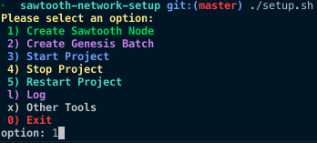
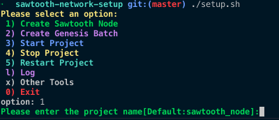
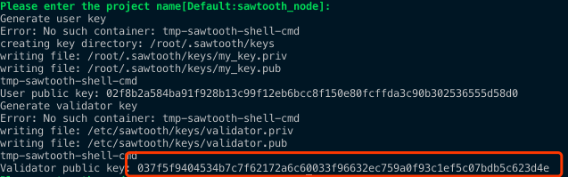
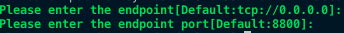
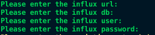
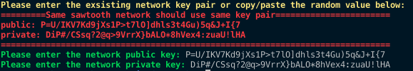
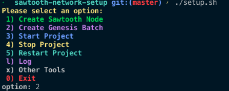
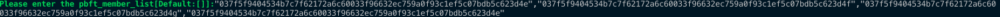
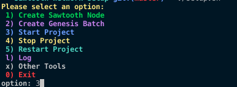

## 0. 准备4台服务器
准备4台服务器，登录到每台服务器，执行./setup.sh脚本。
### 0.1 选择Install Dependency安装依赖（选项0）

## 1. 生成服务器配置
登录到每台服务器，执行./setup.sh脚本。

### 1.1 选择Create Sawtooth Node（选项1）

### 1.2 输入Project Name，默认为sawtooth_node，记录下生成的validator_public_key

### 1.3 输入endpoint以及port，如无特殊需求，默认值即可

### 1.4 输入peers，要求包含网络所有的endpoint的ip及端口，示例如下：

### 1.5 输入rest api端口，默认即可

### 1.6 配置influxdb，如无需要，默认即可

### 1.7 配置网络加密公私钥，如无需要，默认为空即可。注意，网络中所有节点使用相同的公私钥。

## 2. 生成创世节点配置
登录到创世节点（只需一台服务器），执行./setup.sh脚本。
### 1.1 选择Create Genesis Batch（选项2）

### 1.2 输入Project Name，默认为sawtooth_node

### 1.3 输入之前生成的所有的validator public key，示例如下：

## 3. 启动各个节点
登录到各个节点，执行./setup.sh脚本
### 3.1 选择Start Node（选项3）

### 3.2 输入Project Name，默认为sawtooth_node

